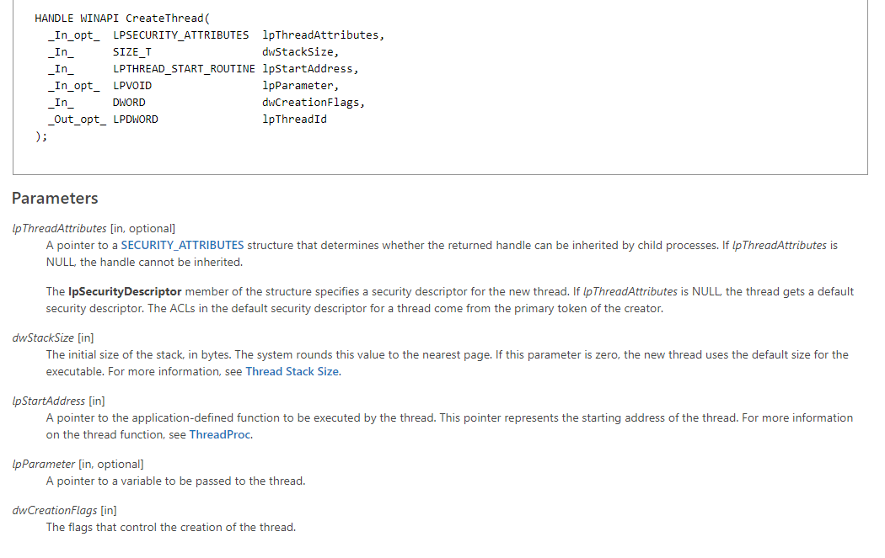
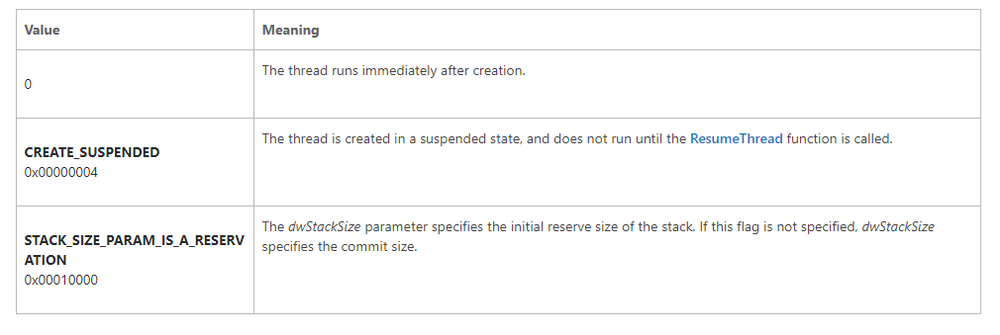
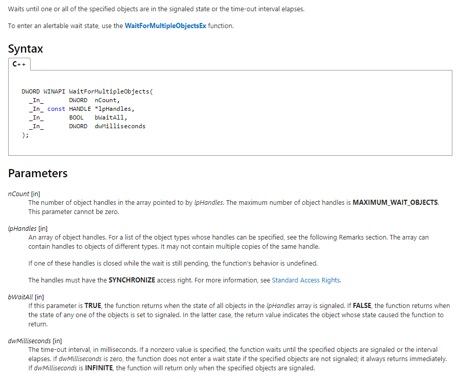
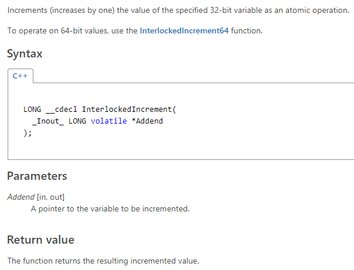
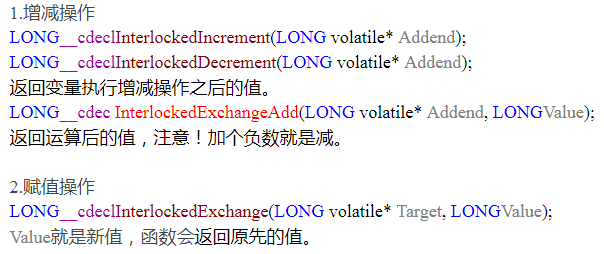

## Windows多线程

### 创建线程的两种方法
`CreateThread`

 

* 参数1：lpThreadAttributes，表示线程内核对象的安全属性，一般传NULL
* 参数2：dwStackSize，线程栈空间大小，传0表示使用默认大小1MB
* 参数3：lpStartAddress，线程要执行的函数地址
* 参数4：lpParameter，传给线程函数的参数
* 参数5：dwCreationFlags，控制线程创建后的动作，0表示创建后立即执行



* 参数6：lpThreadId，返回线程的ID，传入NULL表示不需要返回ID号

`_beginthreadex`


如果在代码中有使用标准C运行库中的函数时，尽量使用`_beginthreadex()`来代替`CreateThread()`
标准C运行库的全局变量或函数可能会因为多线程访问导致数据覆盖，
为了解决这个问题，每个线程都将拥有自己专用的一块内存来供标准C运行库中所有有需要的函数使用，
这块内存区域由`_beginthreadex()`创建
`_beginthreadex()`内部会调用`CreateThread()`

### 常用的函数
`WaitForSingleObject()`
等待直到指定的内核对象被触发


* 参数1：hHandle，要等待的内核对象
* 参数2：dwMilliseconds，等待时间
线程的句柄在线程运行时是未触发的，线程运行结束，句柄处于触发状态，所以可以用此函数等待一个线程运行结束

`WaitForMultipleObjects`


* 参数1：nCount，句柄数量，最大MAXIMUM_WAIT_OBJECTS（64）
* 参数2：lpHandles，句柄数组的指针，HANDLE类型可以为（Event，Mutex，Process，Thread，Semaphore）数组 
* 参数3：bWaitAll，是否等待所有
* 参数4：dwMilliseconds，等待时间

`InterlockedIncrement`
保证在一个线程访问变量时其它线程不能访问，即原子操作（不可打断）



类似还有：



### Critical Section

用于线程间的互斥
    
用法：

```cpp
CRITICAL_SECTION  g_csThreadParameter;
InitializeCriticalSection(&g_csThreadParameter);
EnterCriticalSection(&g_csThreadParameter);
//do sth
LeaveCriticalSection(&g_csThreadParameter);
DeleteCriticalSection(&g_csThreadParameter);
```

可以将关键段比作旅馆的房卡，调用EnterCriticalSection()即申请房卡，得到房卡后自己当然是可以多次进出房间的，在你调用LeaveCriticalSection()交出房卡之前，别人自然是无法进入该房间。<br>
回到这个经典线程同步问题上，主线程正是由于拥有“线程所有权”即房卡，所以它可以重复进入关键代码区域从而导致子线程在接收参数之前主线程就已经修改了这个参数。所以关键段可以用于线程间的互斥，但不可以用于同步。

### Event

用于线程间的同步

#### 常用函数

`CreateEvent`

```cpp
HANDLECreateEvent(

 LPSECURITY_ATTRIBUTES lpEventAttributes,

 BOOL bManualReset,

 BOOL bInitialState,

 LPCTSTR lpName
);
```

### Mutex

互斥量也是一个内核对象，它用来确保一个线程独占一个资源的访问。互斥量与关键段的行为非常相似，并且互斥量可以用于不同进程中的线程互斥访问资源<br>
与关键段类似，互斥量也是不能解决线程间的同步问题。

#### 常用函数

`CreateMutex`

```cpp
HANDLECreateMutex(

  LPSECURITY_ATTRIBUTESlpMutexAttributes,

  BOOLbInitialOwner,     

  LPCTSTRlpName
);
```


函数说明：

* 第一个参数表示安全控制，一般直接传入NULL。

* 第二个参数用来确定互斥量的初始拥有者。如果传入TRUE表示互斥量对象内部会记录创建它的线程的线程ID号并将递归计数设置为1，由于该线程ID非零，所以互斥量处于未触发状态。如果传入FALSE，那么互斥量对象内部的线程ID号将设置为NULL，递归计数设置为0，这意味互斥量不为任何线程占用，处于触发状态。

* 第三个参数用来设置互斥量的名称，在多个进程中的线程就是通过名称来确保它们访问的是同一个互斥量。


成功返回一个表示互斥量的句柄，失败返回NULL。

`OpenMutex`

```cpp
HANDLEOpenMutex(

 DWORDdwDesiredAccess,

 BOOLbInheritHandle,

 LPCTSTRlpName     //名称
);
```

* 第一个参数表示访问权限，对互斥量一般传入MUTEX_ALL_ACCESS。详细解释可以查看MSDN文档。

* 第二个参数表示互斥量句柄继承性，一般传入TRUE即可。

* 第三个参数表示名称。某一个进程中的线程创建互斥量后，其它进程中的线程就可以通过这个函数来找到这个互斥量。

成功返回一个表示互斥量的句柄，失败返回NULL。


`ReleaseMutex`

访问互斥资源前应该要调用等待函数，结束访问时就要调用ReleaseMutex()来表示自己已经结束访问，其它线程可以开始访问了。

1.互斥量是内核对象，它与关键段都有“线程所有权”所以不能用于线程的同步。

2.互斥量能够用于多个进程之间线程互斥问题，并且能完美的解决某进程意外终止所造成的“遗弃”问题。

[**互斥量和关键段的区别**](http://blog.csdn.net/lizhihaoweiwei/article/details/39186333)

互斥量可以使用WaitForSingleObject等待任意时间<br>
互斥量是一个内核对象，它被操作系统拥有，而内核对象可以在不同进程之间拷贝。所以互斥量可以 用于不同进程之间互斥，而关键段则没有这样的效果