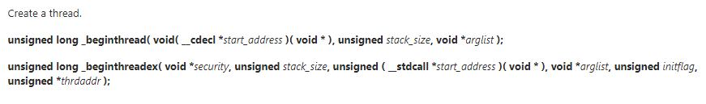
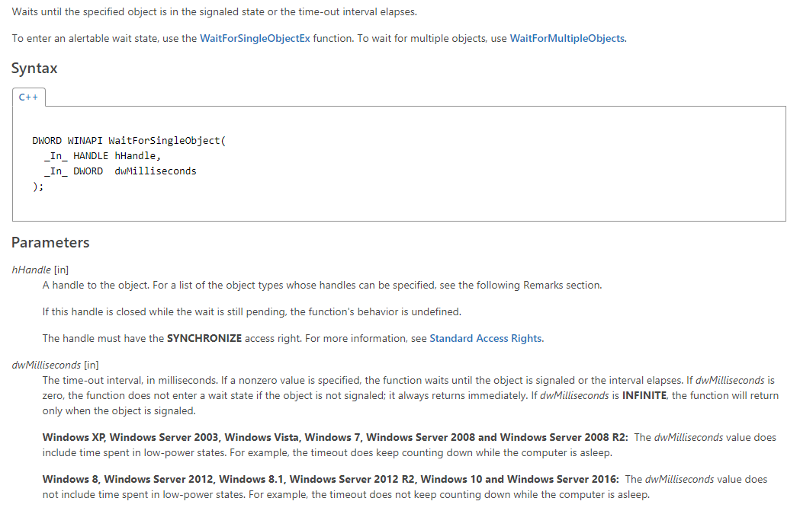

##Windows多线程

### 创建线程的两种方法
`CreateThread`

 

* 参数1：lpThreadAttributes，表示线程内核对象的安全属性，一般传NULL
* 参数2：dwStackSize，线程栈空间大小，传0表示使用默认大小1MB
* 参数3：lpStartAddress，线程要执行的函数地址
* 参数4：lpParameter，传给线程函数的参数
* 参数5：dwCreationFlags，控制线程创建后的动作，0表示创建后立即执行


* 参数6：lpThreadId，返回线程的ID，传入NULL表示不需要返回ID号

`_beginthreadex`



如果在代码中有使用标准C运行库中的函数时，尽量使用`_beginthreadex()`来代替`CreateThread()`
标准C运行库的全局变量或函数可能会因为多线程访问导致数据覆盖，
为了解决这个问题，每个线程都将拥有自己专用的一块内存来供标准C运行库中所有有需要的函数使用，
这块内存区域由`_beginthreadex()`创建
`_beginthreadex()`内部会调用`CreateThread()`

### 常用的函数
`WaitForSingleObject()`
等待直到指定的内核对象被触发


* 参数1：hHandle，要等待的内核对象
* 参数2：dwMilliseconds，等待时间
线程的句柄在线程运行时是未触发的，线程运行结束，句柄处于触发状态，所以可以用此函数等待一个线程运行结束

`WaitForMultipleObjects`


* 参数1：nCount，句柄数量，最大MAXIMUM_WAIT_OBJECTS（64）
* 参数2：lpHandles，句柄数组的指针，HANDLE类型可以为（Event，Mutex，Process，Thread，Semaphore）数组 
* 参数3：bWaitAll，是否等待所有
* 参数4：dwMilliseconds，等待时间

`InterlockedIncrement`
保证在一个线程访问变量时其它线程不能访问，即原子操作（不可打断）


类似还有：


### Critical Section

用于线程间的互斥
    
用法：

```cpp
CRITICAL_SECTION  g_csThreadParameter;
InitializeCriticalSection(&g_csThreadParameter);
EnterCriticalSection(&g_csThreadParameter);
//do sth
LeaveCriticalSection(&g_csThreadParameter);
DeleteCriticalSection(&g_csThreadParameter);
```

可以将关键段比作旅馆的房卡，调用EnterCriticalSection()即申请房卡，得到房卡后自己当然是可以多次进出房间的，在你调用LeaveCriticalSection()交出房卡之前，别人自然是无法进入该房间。<br>
回到这个经典线程同步问题上，主线程正是由于拥有“线程所有权”即房卡，所以它可以重复进入关键代码区域从而导致子线程在接收参数之前主线程就已经修改了这个参数。所以关键段可以用于线程间的互斥，但不可以用于同步。

### Event

用于线程间的同步

#### 常用函数

`CreateEvent`

```cpp
HANDLECreateEvent(

 LPSECURITY_ATTRIBUTES lpEventAttributes,

 BOOL bManualReset,

 BOOL bInitialState,

 LPCTSTR lpName
);
```
